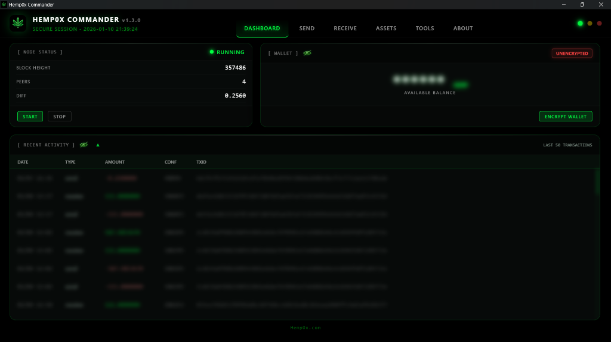
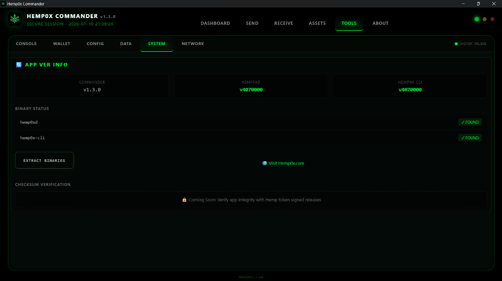
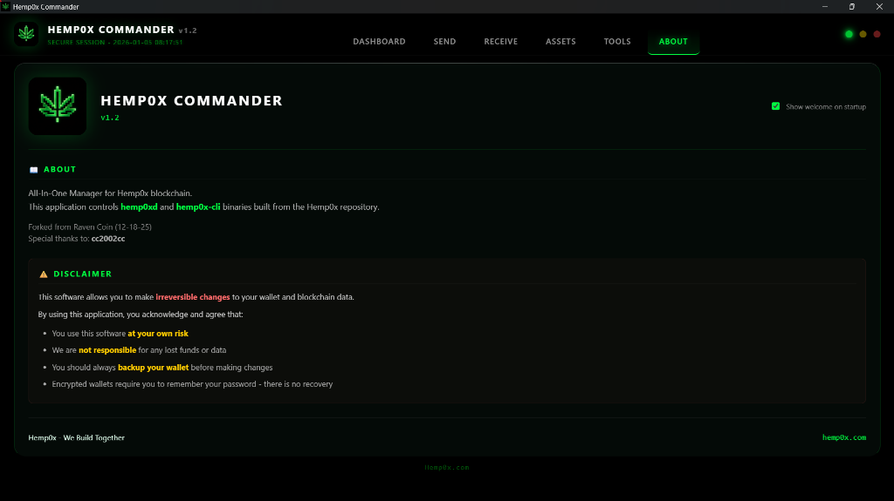

# Hemp0x Commander

<div align="center">
  <a href="https://hemp0x.com">
    
  </a>

  <h3>Interface for the Hemp0x Blockchain</h3>

  <p>
    A secure, non-custodial, and cross-platform dashboard for managing your node and assets.
  </p>

  <br />

  [](https://hemp0x.com)
  [](https://github.com/beyondcr/hemp0x-commander/releases)
  [](https://discord.gg/FMEKJUwcsu)
  [](docs/BUILDING.md)
</div>

<br />



---

## ⚡ Overview

**Hemp0x Commander** brings the power of the Hemp0x blockchain to your desktop. Built with **Tauri v2** (Rust) and **Svelte 5**, it combines the security of a local full node with the ease of use of a modern web application.

> [!WARNING]
> ### ⚠️ STATE: ACTIVE DEVELOPMENT
> **This software is currently in Beta (v1.2). While functional, it is evolving.**
>
> *   🐛 **Expect bugs.**
> *   🎨 **Expect UI changes.**
> *   � **Use at your own risk.** We are not responsible for lost funds or data.
> *   💾 **Always backup your `wallet.dat`.**

### ✨ Key Features

| Feature | Description | Status |
| :--- | :--- | :--- |
| **🪙 Asset Management** | Issue, reissue, and transfer unique Hemp0x assets directly from the UI. Visualize your portfolio with rich metadata. | 🚧 **In Testing** |
| **🛡️ Privacy First** | Connects to your own local `hemp0xd` node via authenticated RPC. No third-party servers track your transactions. | ✅ **Stable** |
| **🔧 Coin Control** | (Advanced) Manually select which UTXOs to spend. Optimize privacy or reduce transaction fees. | ✅ **Stable** |
| **🖥️ Node Control** | Start, stop, and monitor your blockchain daemon seamlessly. View sync progress, peer count, and network difficulty. | ✅ **Stable** |
| **🔒 Encryption** | Secures your wallet with AES-256 encryption. Unlock only when necessary to sign transactions. | ✅ **Stable** |

---

## 📸 Screenshots

<div align="center">

| System Status | About & Credits |
|:---:|:---:|
|  |  |

</div>

---

## 📦 Installation

**Windows** & **Linux** supported.

### Windows
1.  Navigate to the **[Releases Page](https://github.com/beyondcr/hemp0x-commander/releases)**.
2.  Download the **Installer** (`.exe`) or the **Portable Version** (`.zip`).
3.  Launch `Hemp0x Commander.exe`.

### Linux
1.  Download the **AppImage** from **[Releases](https://github.com/beyondcr/hemp0x-commander/releases)**.
2.  `chmod +x Hemp0x_Commander_*.AppImage`
3.  ./Launch

---

## 💀 Contributing & Bugs

This application is merely a **Visual Shell** interacting with the core `hemp0xd` binaries. If the shell breaks, your coins are safe in the daemon.

**Found a glitch? Want a feature?**
Don't keep it to yourself.
*   **Report it** on the [Hemp0x Discord](https://discord.gg/FMEKJUwcsu).
*   **Fix it** and submit a PR.
*   **Break it** and tell us how you did it.

*We build together.*

---

## 🛠️ Building from Source

**Prerequisites:** Node.js v18+, Rust Stable.

**Critical Note:** You must manually place `hemp0xd` and `hemp0x-cli` into the `src-tauri/` folder before building.

```bash
npm install
npm run tauri build
```

---

<div align="center">
  <p>Powered by the <b>Hemp0x Blockchain</b>.</p>
  <a href="https://hemp0x.com">hemp0x.com</a>
</div>
